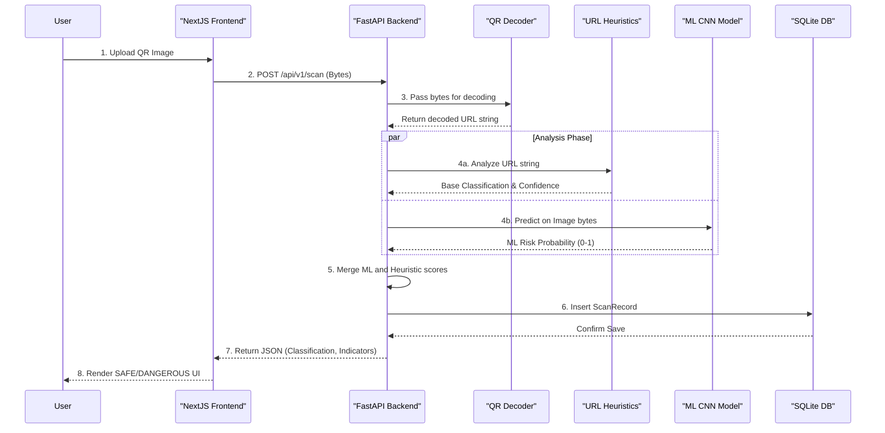

# Data Flow

This document maps the exact step-by-step user journey and data flow from the moment an image is uploaded to the delivery of the final safety classification.

## Sequence Diagram

## Step-by-Step Flow Explanation

### 1. Payload Reception
The Next.js frontend sends a multipart form-data payload containing the user's uploaded QR code image to the FastAPI backend endpoint `POST /api/v1/scan`. 

### 2. Payload Validation & Extraction
The backend validates the file type (must be an image) and file size. It then passes the raw bytes to the `decode_qr_from_bytes` service, which utilizes `pyzbar` and `OpenCV` to parse the QR code pixels and return the hidden URL payload.

### 3. Parallel Threat Analysis
The system executes a bifurcated analysis strategy:
*   **Path A (Heuristics)**: The extracted URL string is evaluated by `phishing_analysis.py`. Points are added to a risk score based on suspicious characteristics (IP usage, deep subdomains, URL length).
*   **Path B (Machine Learning)**: The original raw image bytes are passed to `ml_service.py`. The image is resized to 128x128 pixels, converted to an RGB Numpy array, normalized (dividing by 255.0), and fed into the TensorFlow CNN model. The model outputs a probability of maliciousness.

### 4. Decision Fusion
Back in the `scan_qr` endpoint controller, the two analysis paths are merged. 
*   If the ML probability is > 0.8, the system overrides any safe heuristic classification and labels the QR code `DANGEROUS`. 
*   If the probability is > 0.5 and the heuristic deemed it `SAFE`, it is upgraded to `RISKY`. 
*   The exact ML score is appended to the user-facing `indicators` list.

### 5. Persistence and Response
The final decision is persisted in the SQLite database via SQLAlchemy. The backend then constructs a `ScanResponse` Pydantic schema and returns a structured JSON object to the Next.js frontend, which dynamically renders the warning UI for the user.
