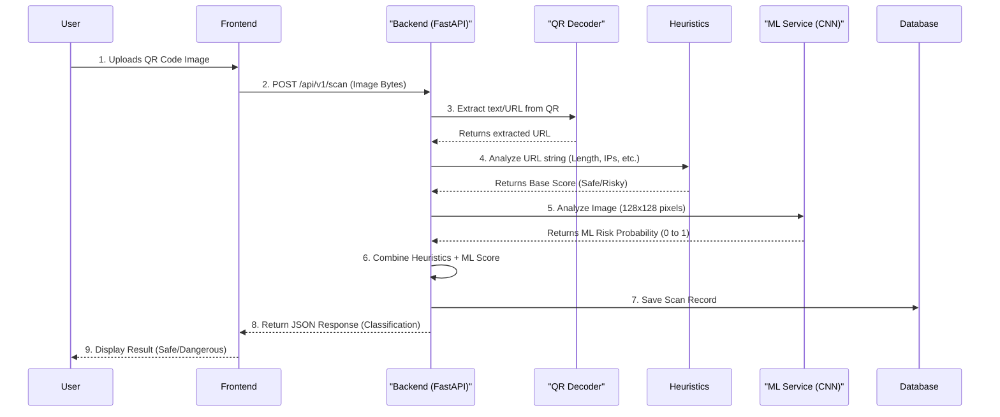

# Full System Flow: QR Code Phishing Detection

Here is the complete journey of what happens when a user uploads a QR code to your application. This covers the frontend, backend, heuristic analysis, and the ML model integration.

## Architecture Diagram



---

## Step-by-Step User Journey

### 1. The Frontend (User Upload)
*   **Action:** The user visits your web application and uploads an image of a QR code using a file picker or by taking a photo.
*   **Under the hood:** The frontend (React, Vue, or Vanilla JS) takes this image file and sends it via an HTTP `POST` request to the backend's `/api/v1/scan` endpoint. The image is sent as raw file bytes.

### 2. The Backend (Receiving the Image)
*   **Action:** Your FastAPI backend receives the request in the `scan_qr` function (inside `qr-code-fishing-backend/app/api/routers/scan.py`).
*   **Under the hood:** It first checks if the uploaded file is actually an image and ensures it isn't too large. If everything looks good, it reads the raw bytes of the image into memory.

### 3. Decoding the QR Code (Text Extraction)
*   **Action:** The backend needs to know what text/URL is hidden inside the QR code.
*   **Under the hood:** It passes the image bytes to `decode_qr_from_bytes()`. This function uses libraries like `pyzbar` and `OpenCV` to visually scan the image and extract the embedded URL (e.g., `https://evil-phishing-site.com`). 

### 4. Heuristic Analysis (Rule-Based Checking)
*   **Action:** The backend runs a quick, rule-based check on the extracted URL.
*   **Under the hood:** It passes the URL string to `analyze_url()`. This engine checks for common phishing tricks:
    *   Is the URL too long?
    *   Does it use an IP address instead of a domain name?
    *   Does it use a non-standard port?
    *   It calculates a "base" risk score and an initial classification (`SAFE`, `RISKY`, or `DANGEROUS`).

### 5. Machine Learning Analysis (Your CNN Model)
*   **Action:** While the URL is being checked, the backend *also* passes the actual image of the QR code to your ML model.
*   **Under the hood:** 
    *   The `predict_image()` function in `ml_service.py` receives the image.
    *   It resizes the image to 128x128 pixels and normalizes the colors.
    *   It feeds the image into your loaded `model.h5` CNN.
    *   The model outputs a probability (e.g., `0.92`, meaning it is 92% confident the QR code is malicious based on its visual patterns).

### 6. Combining the Results
*   **Action:** The backend combines the heuristic score with the ML model's prediction to make a final decision.
*   **Under the hood:** 
    *   If the ML model is highly confident that it is malicious (e.g., score > 0.8), it overrides the heuristic engine and forces the classification to `DANGEROUS`.
    *   It also attaches an indicator message like `"ML visual risk score: 92.0%"` so the user knows *why* it was flagged.

### 7. Database Storage
*   **Action:** The backend logs the scan for historical data and analytics.
*   **Under the hood:** It saves the extracted URL, the final classification, the confidence score, and the indicators into the SQLite database (`qr_phishing.db`).

### 8. The Response (Backend to Frontend)
*   **Action:** The backend replies to the frontend with the final result.
*   **Under the hood:** It sends a JSON response back to the frontend that looks something like this:
    ```json
    {
      "scan_id": 123,
      "payload_kind": "url",
      "extracted_url": "https://evil-phishing-site.com",
      "classification": "dangerous",
      "confidence": 92.0,
      "indicators": [
        "URL uses an IP address.",
        "ML visual risk score: 92.0%"
      ],
      "link_analysis_applied": true
    }
    ```

### 9. The Frontend (Display to User)
*   **Action:** The frontend receives the JSON data and updates the user interface.
*   **Under the hood:** The UI displays a big red warning sign saying "DANGEROUS QR CODE DETECTED" along with the reasons (indicators) and the ML confidence score, preventing the user from visiting the malicious link!
