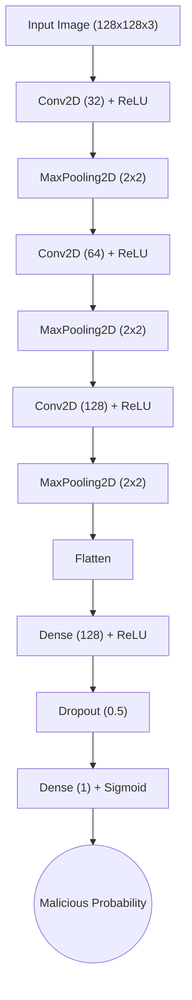
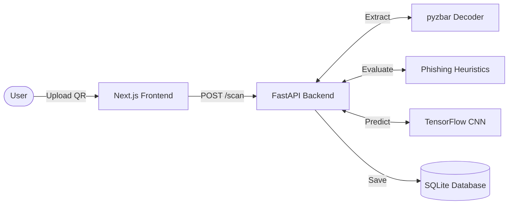
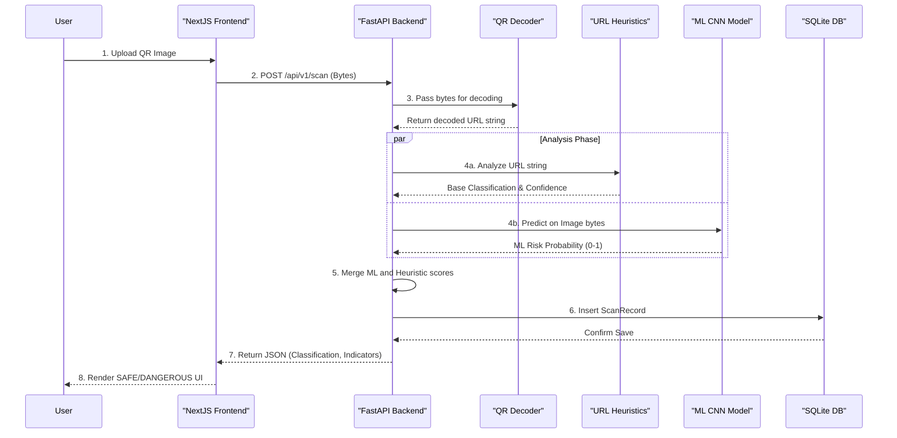

# Comprehensive Research Overview: ML-Enhanced QR Code Phishing Detection

## 1. Abstract
The proliferation of QR codes in physical and digital spaces has introduced a novel vector for phishing attacks (often termed "Quishing"). Attackers embed malicious URLs within QR codes, bypassing traditional email and web-based text filters. This project presents a hybrid detection system that combines traditional rule-based URL heuristics with a state-of-the-art Convolutional Neural Network (CNN) that analyzes the visual artifacts of the QR code itself. By employing this bifurcated analysis, the system achieves robust identification of malicious payloads while maintaining low-latency inference suitable for production environments.

---

## 2. Requirement Analysis

### 2.1 Functional Requirements
1. **Image Ingestion**: The system must accept user-uploaded QR code images via a multipart HTTP form.
2. **Payload Extraction**: The system must accurately decode the embedded text or URL from the QR matrix using optical scanning libraries.
3. **Heuristic URL Analysis**: The system must evaluate the extracted URL against known phishing rules (e.g., raw IP addresses, deep subdomains, non-standard ports, length anomalies).
4. **Visual ML Analysis**: The system must feed the raw image bytes into a trained machine learning model to evaluate visual anomalies indicating malicious generation.
5. **Decision Fusion**: The system must aggregate the heuristic and ML scores to produce a final, definitive safety classification (`SAFE`, `RISKY`, `DANGEROUS`).
6. **Data Persistence**: Scan results, including indicators of compromise (IoCs) and confidence scores, must be stored in a relational database for auditing.

### 2.2 Non-Functional Requirements
1. **Performance**: The ML model must be loaded into memory globally upon application startup to eliminate disk I/O latency during inference.
2. **Scalability**: The backend must utilize asynchronous I/O (FastAPI) to handle multiple simultaneous scan requests.
3. **Resilience**: If the ML model file is missing or fails to load, the system must gracefully fall back to heuristic analysis without crashing.

---

## 3. Machine Learning Research Context

The core intelligence of the system relies on a CNN model trained specifically to classify QR code images based on visual features. The research and training phase was conducted using Google Colab (`qr_code.ipynb`).

### 3.1 Dataset Preparation
*   **Volume**: The model was trained on a dataset of over 200,000 QR codes, evenly split into `benign` (label 0) and `malicious` (label 1) classes.
*   **Preprocessing Pipeline**:
    *   Images are converted to the **RGB color space**.
    *   Images are strictly resized to **128x128 pixels** to standardize the input tensor.
    *   Pixel values are normalized by dividing by **255.0**, scaling the data to a range of `[0.0, 1.0]`. This normalization drastically improves the stability and convergence speed of the neural network.

### 3.2 CNN Architecture
The network follows a feature-extraction to classification pipeline built with TensorFlow/Keras:

1.  **Conv2D (32 filters, 3x3)** + ReLU Activation $\rightarrow$ `MaxPooling2D (2x2)`
2.  **Conv2D (64 filters, 3x3)** + ReLU Activation $\rightarrow$ `MaxPooling2D (2x2)`
3.  **Conv2D (128 filters, 3x3)** + ReLU Activation $\rightarrow$ `MaxPooling2D (2x2)`
4.  **Flatten**: Converts 3D feature maps into a 1D vector.
5.  **Dense (128 neurons)** + ReLU Activation.
6.  **Dropout (0.5)**: Randomly disables 50% of neurons to mitigate overfitting.
7.  **Output Dense (1 neuron)** + Sigmoid Activation: Squashes the output into a probability score representing the malicious risk.

### 3.3 Training Configuration
*   **Optimizer**: Adam (Adaptive Moment Estimation).
*   **Loss Function**: Binary Cross-Entropy.
*   **Callbacks**: 
    *   `EarlyStopping` (restores best weights if validation loss plateaus).
    *   `ReduceLROnPlateau` (fine-tunes the learning rate during difficult convergence phases).

---

## 4. System Architecture

The project is structured as a modern, decoupled multi-tier application:

*   **Frontend (Next.js & React)**: Provides the user interface. It handles file selection, initiates API calls, and parses the JSON response to render dynamic warning UIs.
*   **Backend (FastAPI - Python)**: The orchestrator. It manages the HTTP layer, file validation, and delegates tasks to internal services.
*   **Threat Engine (Heuristics + ML)**: The core business logic layer. It utilizes `pyzbar`/`OpenCV` for decoding, custom Python logic for URL heuristics, and TensorFlow for CNN inference.
*   **Database (SQLite + SQLAlchemy)**: The persistence layer mapping Python objects to relational tables.

---

## 5. Implementation Details: The Bifurcated Analysis

The most critical aspect of the implementation is the parallel threat analysis executed in the `/scan` endpoint.

1.  **Optical Decoding**: The uploaded bytes are passed to `decode_qr_from_bytes()`. If `pyzbar` fails, it falls back to OpenCV.
2.  **Path A (Heuristic)**: The extracted URL is passed to `analyze_url()`, which applies a penalty-based scoring system for suspicious URL structures.
3.  **Path B (Machine Learning)**: The raw image bytes are passed to `predict_image()` in `ml_service.py`. The image is resized, normalized, and evaluated by the in-memory `.h5` model.
4.  **Decision Fusion**: 
    *   If the ML model is highly confident ($>80\%$) that the image is malicious, it overrides any "safe" heuristic score and forces a `DANGEROUS` classification.
    *   If the ML model detects moderate risk ($>50\%$), it escalates a `SAFE` heuristic score to `RISKY`.

---

## 6. Comprehensive System Flow

---

## 7. Conclusion
By integrating a custom-trained Convolutional Neural Network with traditional URL heuristics, this system addresses the unique challenges of Quishing. Relying solely on URL analysis is often insufficient, as attackers frequently use obfuscation techniques. The addition of the visual ML layer acts as a powerful safety net, identifying malicious generation patterns that traditional string analysis would miss, resulting in a highly accurate and resilient threat detection platform.
